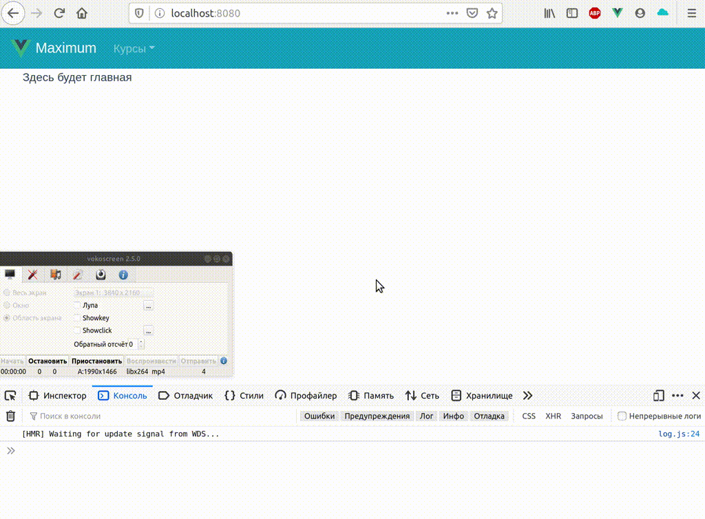

## Задание
Реализовать вехнеуровневый прототип образовательного веб-приложения

## Условия

- Лейаут должен состоять из шапки и тела приложения. В шапке - какое-нибудь текстовое лого и селект с выбором курса (ендпойнт указан ниже). В теле - будут рендериться странички.
- Приложение должно содержать 3 страницы: главную, страницу с расписанием и страницу конкретного занятия.
- На главной достаточно отобразить только надпись "Здесь будет главная"
- На расписании должен быть список занятий (представим, что у нас неправильные бэки и в эндпойнтах нет никакой фильтрации и пока мы учим бэков уму-разуму, получать мы будем все занятия для всех курсов, но отображать нужно только для выбранного в шапке)
- В списке занятий также нужно добавить пагинацию по 5 занятий на страничку
- Где-то на элементе занятия должна быть ссылка на переход на страницу занятия, которая содержит 2 вкладки (вложенных роута) - тесты и статистика. Их содержимое можно заглушить наподобие главной
- Данные нужно хранить во vuex-сторе

## Endpoints

Курсы: https://5daca7380af117001417072a.mockapi.io/api/v1/courses

Занятия: https://5daca7380af117001417072a.mockapi.io/api/v1/lessons
## Результат:

